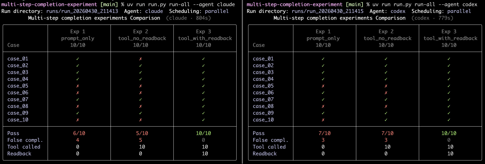

# Multi-step Completion Experiment

用一個實驗來測一個假說：

> **當 workflow 的成敗取決於外部事實時，完成判定不能只寫在 prompt 裡；agent 必須把工具結果讀回來，並讓 pass/fail 真正成為 gate。**

這個實驗以 Markdown footnote 整理作為基底任務。任何有 deterministic checker 的工作，其實都可以套用同一個框架。三個變體把其他條件都固定，只改 *gate 機制*；runner 會量測 false completion、tool 使用情況，以及 read-back 行為。

---

## 三個變體

| Variant              | agent 可以做的事                                         | 完成判定的責任在哪裡 |
| -------------------- | --------------------------------------------------- | ---------- |
| `prompt_only`        | 只能自我檢查，禁止呼叫 checker                                 | 模型自己       |
| `tool_no_readback`   | 必須呼叫 checker，但只能用 `--mode accepted`（不會收到 pass/fail） | 模型自己       |
| `tool_with_readback` | 必須呼叫 checker `--mode full`，讀回 pass/fail，失敗就修正重跑     | 外部 gate    |

假說是：`prompt_only` 與 `tool_no_readback` 的 false completion 應該接近；`tool_with_readback` 則應該幾乎為 0。

---

## Quickstart

```bash
uv run run.py doctor                       # 檢查環境
uv run run.py run-all --agent local-demo   # deterministic smoke test
uv run run.py run-all --agent claude       # 真實 Claude Code CLI
uv run run.py run-all --agent codex        # 真實 Codex CLI
```

結果會寫在 `runs/<run_id>/all_summary.md`。

本實驗不需要 OpenAI 或 Anthropic API key。runner 會直接呼叫本機已登入的 Claude Code CLI 或 Codex CLI。

---

## 進度顯示

`run-all` 會用 Rich Live Table 即時顯示進度（per-case 列、per-experiment 欄）：



格子符號的意義如下：`✓` pass、`✗` false completion、`⚠` honest fail、`·` pending、`✗E` agent 執行失敗。

---

## 什麼是 false completion

當 agent 自己宣告 `model_status = "completed"`，但外部 checker 在 agent 跑完後獨立執行，回報 `pass = False`，這個 case 就會被標記為 `false_completion = True`。

這是整個實驗最核心的指標：agent 說自己做完了，和外部事實之間到底有沒有落差。

---

## 10 個 cases

每個 case 都是一份帶有 footnote 缺陷的小型 Markdown 文件。Checker（`check_footnotes`）會驗證 ref/def 是否對應、是否唯一，以及順序是否正確。

| #  | 缺陷                            |
| -- | ----------------------------- |
| 01 | 引用順序錯亂；有引用無定義；有定義無引用          |
| 02 | 重複定義                          |
| 03 | 正文引用順序正確，定義區順序錯亂              |
| 04 | 多個缺漏定義                        |
| 05 | 定義很多，正文只引用一個                  |
| 06 | 非連續編號                         |
| 07 | 同一 footnote 被多次引用（原本就合法，不應動到） |
| 08 | 正文沒有 ref，但有殘留的 def            |
| 09 | 定義內含 URL，引用順序錯亂               |
| 10 | 混合缺陷                          |

Canonical answer 由 input 決定。每個 case 的 input → expected 對照表見 [`docs/cases.md`](docs/cases.md)；任何候選答案都可以用 `uv run run.py check-file <answer.md>` 驗證。

---

## Output 結構

```text
runs/<run_id>/
├── all_results.jsonl           # 每個 case 一筆 JSON record（含三個 experiment）
├── all_summary.md              # markdown summary table
├── experiment_1/
│   ├── results.jsonl
│   └── summary.md
├── experiment_2/ ...
└── experiment_3/ ...
```

per-case workspace（`experiment_1/case_01/...`）預設會在 grading 後刪除。加上 `--keep-workspaces` 可以保留 `input.md`、`task_prompt.md`、`final.md`、`result.json`，以及 agent 的 stdout/stderr。

---

## 怎麼看 summary

```text
| Experiment         | Cases | Completed | Actual Pass | False Completion | Tool Called | Readback Used | ... |
| prompt_only        | 10    | …         | …           | …                | =0          | =0            | ... |
| tool_no_readback   | 10    | …         | …           | …                | =10         | =0            | ... |
| tool_with_readback | 10    | …         | …           | …                | =10         | =10           | ... |
```

`=0` / `=10` 這類欄位，是實驗設計本身直接保證的結果。變體一不該呼叫工具；變體三的每個 case 都必須讀回完整結果。其他欄位，像是 `Completed`、`Actual Pass`、`False Completion`、`Retry Used`、`Agent Failures`，才是實跑後得到的資料。

看這張表時，重點不是哪一組 `Actual Pass` 最高，而是 **`False Completion` 是否從 `prompt_only` / `tool_no_readback` 到 `tool_with_readback` 明顯下降**。

各欄位意義如下：

| 欄位                 | 意義                                                     |
| ------------------ | ------------------------------------------------------ |
| Cases              | 本次跑了幾個 case                                            |
| Completed          | agent 宣告完成的 case 數                                     |
| Actual Pass        | `final.md` 實際通過 checker 的 case 數                       |
| False Completion   | agent 宣告完成，但 checker 判失敗的 case 數                       |
| Tool Called        | 有呼叫 checker 的 case 數                                   |
| Readback Used      | 收到含 `pass` 欄位的 full-mode 結果的 case 數                    |
| Preflight Failures | Exp 3 中，原始 input 第一次 full check 就失敗的 case 數            |
| Repair Triggered   | Exp 3 中，因 preflight 失敗而進入修正流程的 case 數                  |
| Retry Used         | 修正後仍失敗、再次修正的次數（preflight 不算 retry）                     |
| Agent Failures     | agent 沒產出合法 `result.json`、CLI 非 0 exit，或其他執行錯誤的 case 數 |

---

## CLI Reference

| Subcommand                                       | 用途                                                 |
| ------------------------------------------------ | -------------------------------------------------- |
| `doctor`                                         | 檢查 CLI 是否安裝可用                                      |
| `run-all --agent <name>`                         | 平行跑全部三個 experiment                                 |
| `run-experiment <1\|2\|3> --agent <name>`        | 跑單一 experiment                                     |
| `prompt <1\|2\|3> <case_id>`                     | 印出 runner 會送給 agent 的 prompt                       |
| `tool-check-file <path> --mode <accepted\|full>` | Exp 2/3 使用的 checker（accepted 只回 run_id；full 回完整結果） |
| `check-file <path>`                              | 在本機執行 checker，印出結果                                 |
| `grade <results.jsonl>`                          | 用最新 grader 重新 grade 一個 JSONL                       |
| `summary <results.jsonl>`                        | 印出 summary table                                   |

常用 options：

* `--cases case_01 case_02` — 只跑指定 cases
* `--sequential-experiments` — 序列執行三個 experiment，不平行
* `--no-progress` — 關掉 live table
* `--keep-workspaces` — 保留 per-case debug 檔
* `--claude-model <name>` / `--codex-model <name>` — 指定要用的模型（預設讓各自 CLI 決定；也可用 `CLAUDE_MODEL` / `CODEX_MODEL` 環境變數）
* `--claude-permission-mode <mode>` / `--claude-extra-args …`
* `--codex-sandbox <mode>` / `--codex-extra-args …`

---

## 專案結構

```text
multi-step-completion-experiment/
├── run.py                  # 全部邏輯：cases、checker、runner、grader、UI
├── docs/                   # 額外設計筆記
├── tests/                  # build_task_prompt 的結構不變測試
├── sample_outputs/         # local-demo 的參考輸出
└── runs/                   # gitignored — 每次執行的產出
```

10 個 cases 的內容直接寫在 `run.py` 的 `CASES` dict 裡，方便單檔散布；不需要額外的外部資料檔。

執行測試：

```bash
uv run --with pytest --with "rich>=13.0" pytest tests/
```

測試只鎖每個 experiment prompt 的高層結構（有沒有 Steps / Constraints / 對應的 gate clause），文字本身的微調不會被鎖死。

---

## 安全提醒

Runner 會讓選定的 agent 在 case workspace 內讀寫檔案：Claude 使用 `bypassPermissions`，Codex 使用 `workspace-write` sandbox。建議在乾淨的資料夾裡執行；不要把 secrets、credentials、`.env` 和 case workspace 放在一起。

第一次建議先跑 `--agent local-demo`，先確認 harness 本身通了，再切到真實 CLI。
